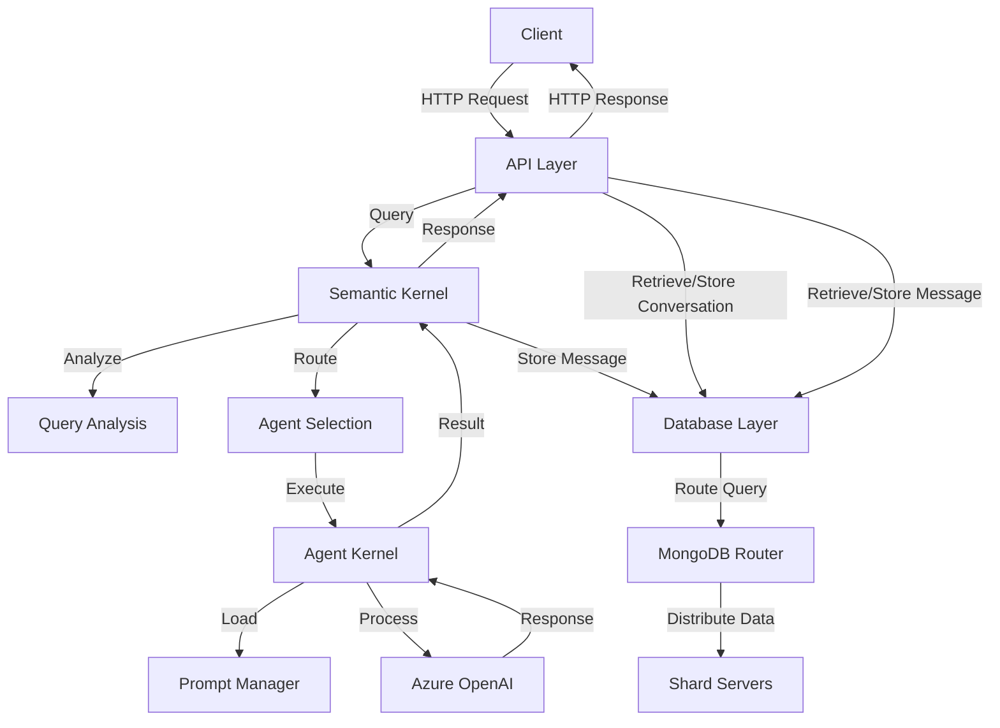

# Maarefa Agent V2

A sophisticated AI agent system built with FastAPI and Azure OpenAI, designed to handle various types of queries through specialized agents.

## Features

- Multiple specialized agents for different types of queries:
  - Chat Agent: General conversation and interactions
  - Summarization Agent: Text and content summarization
  - Study Agent: Study materials and methodology
  - Knowledge QA Agent: Specific content questions
  - Clarification Agent: Query refinement and clarification

- Dynamic prompt management system
- Azure OpenAI integration
- **MongoDB-based conversation and message storage with sharding support**
- Docker-based deployment
- FastAPI backend

## System Architecture

The system is built with a modular, layered architecture that separates concerns and promotes maintainability.

### Core Components

1. **API Layer**
   - FastAPI-based REST API
   - Request/Response handling
   - Input validation
   - Error handling

2. **Semantic Kernel**
   - Query analysis and routing
   - Agent supervision
   - Response aggregation
   - Error handling

3. **Agent Kernel**
   - Base agent implementation
   - Specialized agent implementations
   - Azure OpenAI integration
   - Response processing

4. **Prompt Management**
   - Dynamic prompt loading
   - Prompt type management
   - Context-aware prompt selection

5. **Database Layer**
   - MongoDB for persistent storage of conversations and messages
   - Sharded architecture for horizontal scaling
   - Config servers for cluster metadata
   - Shard servers for data distribution
   - Router (mongos) for query routing
   - Automatic sharding by conversation_id for optimal data distribution

### Component Interaction



## Database Architecture

The system uses MongoDB with a sharded architecture for optimal performance and scalability:

### Components

1. **Config Servers (3 nodes)**
   - Store cluster metadata
   - Manage shard distribution
   - Ensure high availability

2. **Shard Servers (2 nodes)**
   - Store actual data
   - Distribute data based on conversation_id
   - Enable horizontal scaling

3. **Router (mongos)**
   - Route queries to appropriate shards
   - Handle query distribution
   - Manage connection pooling

### Sharding Strategy

- **Shard Key**: `conversation_id` (hashed)
- **Distribution**: Messages are distributed across shards based on conversation_id
- **Benefits**:
  - Even data distribution
  - Efficient query routing
  - Horizontal scalability
  - Improved read/write performance

### Indexes

- `conversation_id` + `created_at` (compound index)
- `user_id` + `created_at` (compound index)

## Agent System

### Agent Types

1. **Chat Agent**
   - Purpose: Handles general conversation and chat interactions
   - Prompt Types: general, technical, creative
   - Use Cases: General conversation, information requests, casual interaction

2. **Summarization Agent**
   - Purpose: Handles text summarization and content condensation
   - Prompt Types: text, document, meeting
   - Use Cases: Text summarization, document summarization, meeting notes

3. **Study Agent**
   - Purpose: Provides overview of available studies
   - Prompt Types: concept, problem, review, overview
   - Use Cases: Study material overview, concept explanation, methodology guidance

4. **Knowledge QA Agent**
   - Purpose: Handles specific content questions and knowledge retrieval
   - Prompt Types: simple_qa, complex_qa
   - Use Cases: Factual questions, complex queries, knowledge retrieval

5. **Clarification Agent**
   - Purpose: Helps clarify and refine user queries
   - Prompt Types: general, technical, study
   - Use Cases: Query refinement, concept clarification, study-related clarification

## API Reference

### Base URL
```
http://localhost:8000
```

### Endpoints

#### POST /api/agents/query

Process a query using the semantic kernel supervisor and store conversation messages.

This endpoint validates the conversation, creates a user message, processes the query, creates an agent message with the response, and returns the response. The conversation history can be retrieved using the `/api/messages/conversation/{conversation_id}` endpoint.

**Request Body:**
```json
{
    "conversation_id": "string",
    "user_id": "string",
    "query": "string"
}
```

**Response:**
```json
{
    "response": "string",
    "metadata": {}
}
```

#### Conversations API

Endpoints for managing conversations.

##### POST /api/conversations

Create a new conversation.

**Request Body:**
```json
{
    "name": "string",
    "user_id": "string"
}
```

**Response:**
```json
{
    "_id": "string",
    "name": "string",
    "user_id": "string",
    "created_at": "datetime"
}
```

##### GET /api/conversations/user/{user_id}

Get all conversations for a specific user with pagination.

**Path Parameters:**
- `user_id`: The ID of the user.

**Query Parameters:**
- `skip`: (Optional) Number of conversations to skip (default: 0).
- `limit`: (Optional) Maximum number of conversations to return (default: 100).

**Response:**
```json
{
    "conversations": [
        {
            "_id": "string",
            "name": "string",
            "user_id": "string",
            "created_at": "datetime"
        }
    ],
    "total": 0
}
```

##### PATCH /api/conversations/{conversation_id}

Update an existing conversation.

**Path Parameters:**
- `conversation_id`: The ID of the conversation to update.

**Request Body:**
```json
{
    "name": "string"
}
```

**Response:**
```json
{
    "_id": "string",
    "name": "string",
    "user_id": "string",
    "created_at": "datetime"
}
```

##### DELETE /api/conversations/{conversation_id}

Delete a conversation.

**Path Parameters:**
- `conversation_id`: The ID of the conversation to delete.

**Response:**
(204 No Content)

#### Messages API

Endpoints for managing messages within conversations.

##### POST /api/messages

Create a new message in a conversation.

**Request Body:**
```json
{
    "conversation_id": "string",
    "user_id": "string",
    "message_data": {
        "type": "string",
        "content": "string"
    }
}
```

**Response:**
```json
{
    "_id": "string",
    "conversation_id": "string",
    "user_id": "string",
    "message_data": {
        "type": "string",
        "content": "string"
    },
    "created_at": "datetime"
}
```

##### GET /api/messages/conversation/{conversation_id}

Get all messages for a specific conversation with pagination.

**Path Parameters:**
- `conversation_id`: The ID of the conversation.

**Query Parameters:**
- `skip`: (Optional) Number of messages to skip (default: 0).
- `limit`: (Optional) Maximum number of messages to return (default: 50).

**Response:**
```json
{
    "messages": [
        {
            "_id": "string",
            "conversation_id": "string",
            "user_id": "string",
            "message_data": {
                "type": "string",
                "content": "string"
            },
            "created_at": "datetime"
        }
    ],
    "total": 0
}
```

## Prompt Management

Prompts are stored in `.prompty` files within the `app/modules/prompt_manager/prompts` directory, organized by agent type:

```
prompts/
├── chat/
│   ├── general.prompty
│   ├── technical.prompty
│   └── creative.prompty
├── summarization/
│   ├── text.prompty
│   ├── document.prompty
│   └── meeting.prompty
├── study/
│   ├── concept.prompty
│   ├── problem.prompty
│   ├── review.prompty
│   └── overview.prompty
├── knowledge_qa/
│   ├── simple_qa.prompty
│   └── complex_qa.prompty
└── clarification/
    ├── general.prompty
    ├── technical.prompty
    └── study.prompty
```

## Development Setup

### Prerequisites

- Python 3.8+
- Docker and Docker Compose
- Azure OpenAI API access

### Development Tools

#### Interactive CLI

The project includes an interactive CLI tool for managing development tasks. To use it:

```bash
# Start the interactive CLI
python scripts/cli.py

# Or use specific commands directly
python scripts/cli.py create-agent
python scripts/cli.py run
python scripts/cli.py test
python scripts/cli.py build
python scripts/cli.py clean
python scripts/cli.py status
```

The CLI provides the following features:
- Interactive agent creation with prompt type selection
- Application management (run, test, build)
- Project maintenance (clean, status)
- Real-time command output
- Colorful and user-friendly interface

#### Agent Creation

You can create new agents in two ways:

1. Using the interactive CLI:
```bash
python scripts/cli.py create-agent
```
This will guide you through:
- Entering the agent name
- Selecting prompt types
- Confirming the creation

2. Using the direct command:
```bash
python scripts/create_agent.py my_new_agent --prompt-types general technical
```

The tool will create all necessary files and provide instructions for updating the agent registry.

### Environment Variables

Create a `.env` file in the root directory with the following variables:

```env
# Azure OpenAI Configuration
AZURE_OPENAI_API_KEY=your_api_key
AZURE_OPENAI_ENDPOINT=your_endpoint
AZURE_OPENAI_DEPLOYMENT_NAME=your_deployment_name

# Application Configuration
APP_ENV=development
PORT=8000
```

### Quick Start

1. Clone the repository:
```bash
git clone https://github.com/yourusername/maarefa-agent-v2.git
cd maarefa-agent-v2
```

2. Create and configure your `.env` file

3. Build and run with Docker:
```bash
docker-compose up --build
```

4. Access the API at `http://localhost:8000`

### Project Structure

```
maarefa-agent-v2/
├── app/
│   ├── api/
│   │   └── endpoints/
│   ├── core/
│   │   └── config/
│   ├── modules/
│   │   ├── agent_kernel/
│   │   ├── prompt_manager/
│   │   └── semantic_kernel/
│   └── main.py
├── docs/
├── tests/
├── .env
├── docker-compose.yml
└── Dockerfile
```

## Testing

### Unit Tests
```bash
pytest tests/
pytest tests/ -v  # verbose
pytest tests/ -k "test_name"  # specific test
```

### Integration Tests
```bash
pytest tests/integration/
```

## Contributing

Please read [CONTRIBUTING.md](CONTRIBUTING.md) for details on our code of conduct and the process for submitting pull requests.

## License

This project is licensed under the MIT License - see the [LICENSE](LICENSE) file for details. 