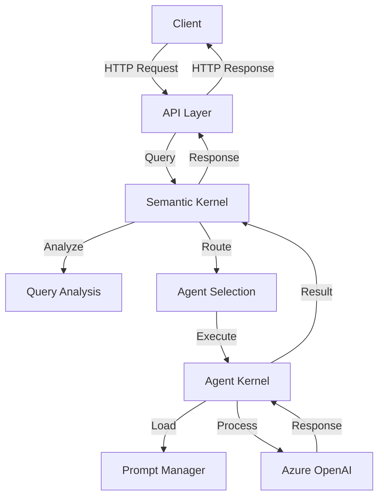

# Architecture Overview

## System Architecture

The Maarefa Agent V2 system is built with a modular, layered architecture that separates concerns and promotes maintainability.

### Core Components

1. **API Layer**
   - FastAPI-based REST API
   - Request/Response handling
   - Input validation
   - Error handling

2. **Semantic Kernel**
   - Query analysis and routing
   - Agent supervision
   - Response aggregation
   - Error handling

3. **Agent Kernel**
   - Base agent implementation
   - Specialized agent implementations
   - Azure OpenAI integration
   - Response processing

4. **Prompt Management**
   - Dynamic prompt loading
   - Prompt type management
   - Context-aware prompt selection

### Component Interaction



## Key Design Patterns

1. **Registry Pattern**
   - Agent registration and discovery
   - Prompt type management
   - Dynamic component loading

2. **Supervisor Pattern**
   - Query analysis and routing
   - Agent coordination
   - Error handling and recovery

3. **Factory Pattern**
   - Agent instantiation
   - Prompt creation
   - Component initialization

4. **Strategy Pattern**
   - Different agent implementations
   - Various prompt strategies
   - Multiple processing approaches

## Data Flow

1. **Query Processing**
   ```
   Client Request
   ↓
   API Layer (Validation)
   ↓
   Semantic Kernel (Analysis)
   ↓
   Agent Selection
   ↓
   Agent Processing
   ↓
   Response Generation
   ↓
   Client Response
   ```

2. **Error Handling**
   ```
   Error Occurrence
   ↓
   Error Capture
   ↓
   Error Classification
   ↓
   Error Response Generation
   ↓
   Client Error Response
   ```

## Configuration Management

- Environment-based configuration
- Docker-based deployment
- Azure OpenAI integration
- Dynamic prompt management

## Security Considerations

1. **API Security**
   - Input validation
   - Rate limiting
   - Error handling
   - Secure headers

2. **Azure OpenAI Security**
   - API key management
   - Endpoint security
   - Request validation
   - Response sanitization

## Scalability

1. **Horizontal Scaling**
   - Docker containerization
   - Stateless design
   - Load balancing ready

2. **Performance Optimization**
   - Caching strategies
   - Connection pooling
   - Async processing
   - Resource management

## Monitoring and Logging

1. **System Monitoring**
   - Performance metrics
   - Resource usage
   - Error tracking
   - Usage statistics

2. **Logging**
   - Request logging
   - Error logging
   - Performance logging
   - Audit logging 