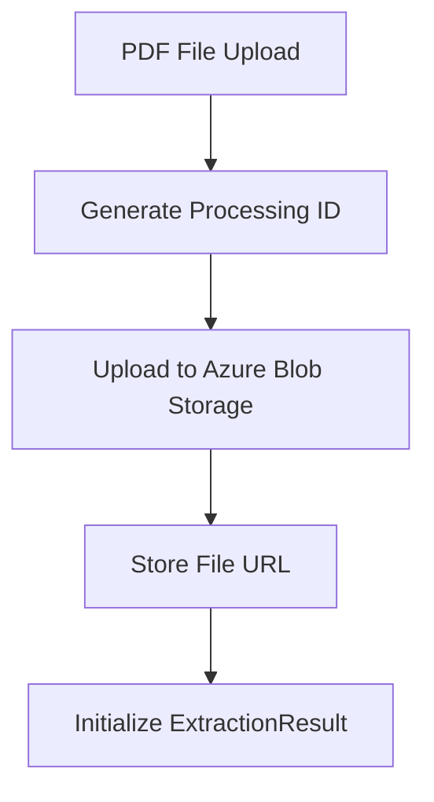
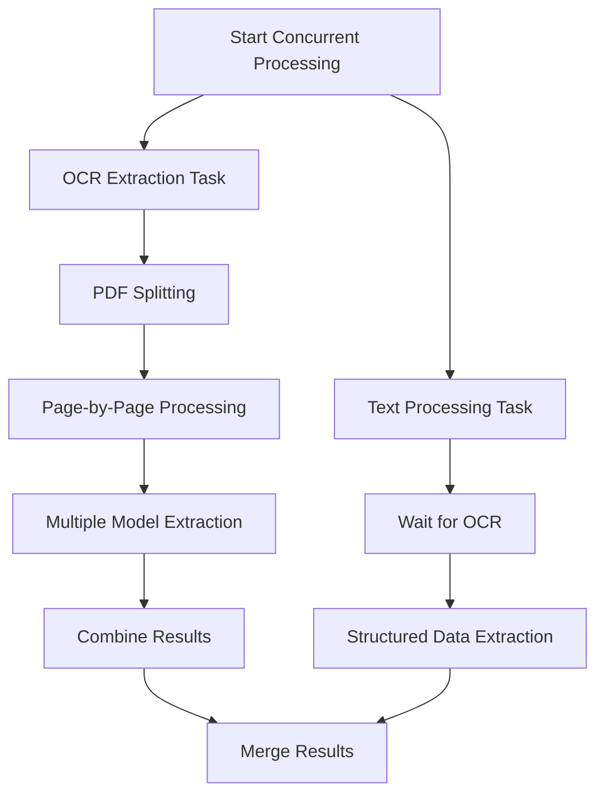
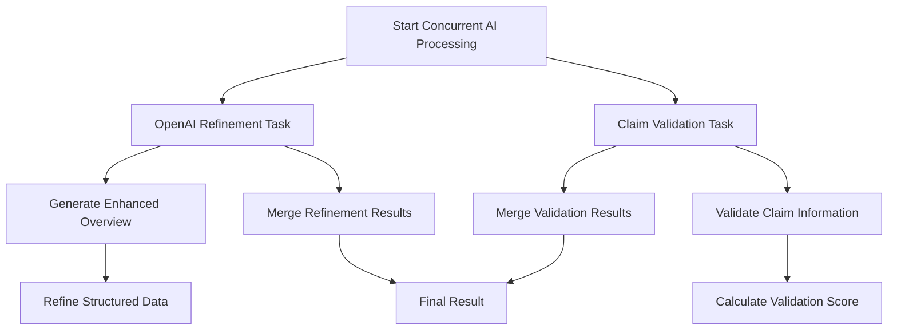
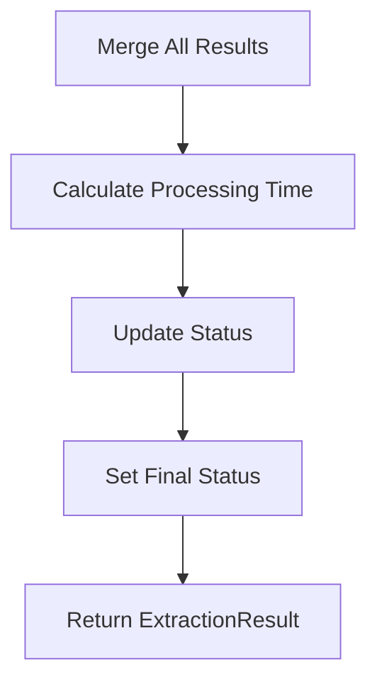

# Claim Extractor Process - Step-by-Step Explanation

## Overview

The Claim Extractor is a sophisticated system that processes PDF legal documents to extract structured claim information. It uses Azure Document Intelligence for OCR, Azure OpenAI for refinement, and concurrent processing for optimal performance.

## Architecture Components

### Core Services
- **ClaimExtractorService**: Main orchestrator
- **PDFSplitterService**: Handles PDF splitting and page-by-page processing
- **TextProcessor**: Extracts structured data using regex patterns
- **OpenAIRefiner**: Enhances results using Azure OpenAI
- **ClaimValidator**: Validates extracted information
- **StorageManager**: Handles file uploads to Azure Blob Storage

## Step-by-Step Process Flow

### 🔄 **Step 1: Initialization & File Upload**



**What happens:**
1. **Generate Processing ID**: Creates unique UUID for tracking
2. **Upload to Blob Storage**: Stores file in Azure with conversation-based path
3. **Store File URL**: Saves the blob storage URL for later access
4. **Initialize Result**: Creates `ExtractionResult` object with initial status

**Key Files:**
- `service.py` - `_upload_file()` method
- `storage_manager.py` - Azure Blob Storage operations

---

### 🔍 **Step 2: Concurrent OCR & Text Processing**



**What happens:**

#### **OCR Extraction (Parallel Task A):**
1. **PDF Splitting**: Uses PyPDF2 to split PDF into individual pages
2. **Page-by-Page Processing**: Processes each page concurrently using `asyncio.gather()`
3. **Multiple Model Extraction**: For each page, tries 3 Document Intelligence models:
   - `prebuilt-layout` - Best for structured documents
   - `prebuilt-document` - Good for general document analysis
   - `prebuilt-read` - Optimized for text extraction
4. **Fallback to PyPDF2**: If all AI models fail, uses PyPDF2 as backup
5. **Combine Results**: Merges text from all pages with page separators

#### **Text Processing (Parallel Task B):**
1. **Wait for OCR**: Waits for OCR extraction to complete
2. **Structured Data Extraction**: Uses regex patterns to extract:
   - Case numbers, dates, names
   - Plaintiff/defendant information
   - Court details, claim amounts
   - Saudi legal document specific fields
3. **Create ClaimInfo**: Populates structured data model

**Key Files:**
- `pdf_splitter.py` - `extract_with_multiple_models()`
- `text_processor.py` - `extract_structured_data()`
- `service.py` - `_extract_raw_text()` and `_process_text_after_ocr()`

---

### 🤖 **Step 3: Concurrent OpenAI Refinement & Validation**



**What happens:**

#### **OpenAI Refinement (Parallel Task A):**
1. **Generate Enhanced Overview**: Creates 5-6 line professional legal analysis
2. **Refine Structured Data**: Improves extracted information using AI
3. **Professional Language**: Uses legal terminology and professional structure

#### **Claim Validation (Parallel Task B):**
1. **Validate Claim Information**: Checks completeness and accuracy
2. **Calculate Validation Score**: Assigns confidence score (0.0-1.0)
3. **Identify Errors**: Lists validation errors and missing fields
4. **Set Validity Flag**: Marks claim as valid/invalid

**Key Files:**
- `openai_refiner.py` - `generate_claim_overview()` and `refine_claim_extraction()`
- `validator.py` - `validate_claim()`

---

### 📊 **Step 4: Result Compilation & Status Update**



**What happens:**
1. **Merge Results**: Combines OCR, text processing, refinement, and validation
2. **Calculate Processing Time**: Records total processing duration
3. **Update Status**: Sets final status based on validation results:
   - `VALIDATED` - If claim is valid
   - `COMPLETED` - If processing completed but validation failed
   - `FAILED` - If errors occurred
4. **Return Result**: Returns complete `ExtractionResult` object

## Data Flow Through Models

### **ExtractionResult** (Main Container)
```python
class ExtractionResult:
    processing_id: str          # Unique tracking ID
    filename: str              # Original filename
    file_url: str              # Blob storage URL
    status: ProcessingStatus   # Current processing status
    raw_text: str              # Combined text from all pages
    raw_text_length: int       # Character count
    page_contents: List[PageContent]  # Individual page details
    extracted_claim: ClaimInfo # Structured claim data
    refined_response: str      # AI-enhanced response
    processing_time: float     # Total processing time
    document_intelligence_confidence: float  # OCR confidence
    openai_confidence: float   # AI refinement confidence
    error_message: str         # Error details if any
```

### **PageContent** (Per-Page Details)
```python
class PageContent:
    page_number: int           # Page number (1-based)
    extracted_text: str        # Text from this page
    confidence: float          # Extraction confidence
    model_used: str            # Which AI model worked best
    success: bool              # Whether extraction succeeded
    processing_time: float     # Time to process this page
    error_message: str         # Page-specific errors
```

### **ClaimInfo** (Structured Data)
```python
class ClaimInfo:
    # Basic Information
    case_number: str           # Case/claim number
    filing_date: str           # Date filed
    
    # Parties
    plaintiff_name: str        # Plaintiff details
    defendant_name: str        # Defendant details
    
    # Case Details
    case_type: str             # Type of case
    case_subject: str          # Subject matter
    claim_amount: str          # Monetary amount
    
    # Enhanced Analysis
    claim_overview: str        # 5-6 line professional summary
    is_valid: bool             # Validation result
    validation_errors: List[str] # Validation issues
```

## Concurrent Processing Benefits

### **Performance Optimization:**
- **OCR + Text Processing**: Run in parallel to save time
- **AI Refinement + Validation**: Run in parallel to save time
- **Page Processing**: All pages processed concurrently
- **Multiple Models**: Try different AI models simultaneously

### **Error Handling:**
- **Graceful Degradation**: If one task fails, others continue
- **Fallback Mechanisms**: PyPDF2 backup if AI models fail
- **Exception Isolation**: Errors in one task don't stop others

## Example Processing Timeline

```
Time 0s:    Start processing
Time 0.1s:  File uploaded to blob storage
Time 0.2s:  OCR extraction starts (parallel)
Time 0.2s:  Text processing waits for OCR (parallel)
Time 2.5s:  OCR completes (3 pages, multiple models)
Time 2.6s:  Text processing completes
Time 2.7s:  OpenAI refinement starts (parallel)
Time 2.7s:  Validation starts (parallel)
Time 8.2s:  OpenAI refinement completes
Time 8.3s:  Validation completes
Time 8.4s:  Results merged and returned
```

## Key Features

### **🔧 Enhanced PDF Processing:**
- Splits multi-page PDFs into individual pages
- Uses multiple Document Intelligence models per page
- Fallback to PyPDF2 if AI models fail
- Preserves page structure and numbering

### **⚡ Concurrent Processing:**
- OCR and text processing run in parallel
- AI refinement and validation run in parallel
- Page-by-page processing runs concurrently
- Significantly reduces total processing time

### **🤖 AI-Powered Enhancement:**
- Generates professional 5-6 line legal analysis
- Uses specialized Saudi legal knowledge
- Refines and validates extracted information
- Provides actionable legal recommendations

### **📊 Comprehensive Results:**
- Detailed page-by-page information
- Structured claim data extraction
- Professional legal analysis
- Validation scores and error reporting

## Error Handling & Resilience

### **File Upload Errors:**
- Retry mechanisms for blob storage
- Graceful handling of network issues

### **OCR Processing Errors:**
- Multiple AI model fallbacks
- PyPDF2 backup extraction
- Page-level error isolation

### **AI Processing Errors:**
- Graceful degradation if OpenAI fails
- Continue with basic extraction results
- Detailed error logging and reporting

### **Validation Errors:**
- Comprehensive error reporting
- Detailed validation scores
- Specific error messages for each field

This sophisticated system ensures robust, fast, and accurate extraction of legal claim information from PDF documents while providing professional-grade analysis and recommendations. 